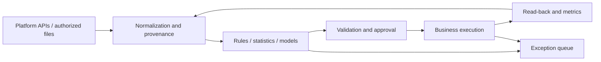

# AI Ecommerce Automation: From Tools to Operating Systems

[Home](../../README.en.md) · [简体中文](../zh-CN/handbook.md) · [Tool catalog](../tools.md) · [Evidence and sources](../sources.md)

> Tools extend our reach. Evidence steadies our sight. Good automation makes action faster and mistakes visible sooner.

This guide serves cross-border sellers, independent stores, brand operators, and developers. It follows demand discovery, product validation, content production, acquisition, fulfillment, service, and learning. It explains how tools form a feedback loop and where judgment still requires evidence from the real world. Untested combinations are reference designs, not deployed systems.

## Contents

1. [Define work worth automating](#c01)
2. [Understand the six layers](#c02)
3. [Make data contracts a shared language](#c03)
4. [Market research and product selection](#c04)
5. [Review analysis and demand discovery](#c05)
6. [Supply chain and product truth](#c06)
7. [Listings and localization](#c07)
8. [Product images and visual consistency](#c08)
9. [Short video and content production](#c09)
10. [Creator research and partnerships](#c10)
11. [Advertising diagnosis and experiments](#c11)
12. [Support, after-sales, and retrieval](#c12)
13. [Orders, inventory, and fulfillment](#c13)
14. [Store growth and repeat purchases](#c14)
15. [Platform integrations and Chuhaijiang](#c15)
16. [Agents, MCP, and browser automation](#c16)
17. [Reliability, security, and evaluation](#c17)
18. [Costs, teams, and implementation](#c18)
19. [Open boundaries](#c19)
20. [Transferable recipes](#c20)

<a id="c01"></a>
## 01 · Define work worth automating

Begin with a recurring business action whose input can be described and whose result can be checked: turning twenty reviews into traceable issue labels, turning an inquiry into a requirements card, or placing yesterday's exceptional orders in a work queue. These tasks are small but directly reduce omissions. If people must continually explain the goal, repair definitions, and supply missing facts, adding tools will only move uncertainty faster.

Write a task card first: who supplies the input, what triggers the work, who receives the output, when it is needed, what must stop execution, and who takes over after failure. Record current manual time, error types, and rework. Without a baseline, efficiency often means only faster generation. With one, you can see whether review effort falls and results become more dependable.

A rough prioritization method is frequency multiplied by time per task and standardizability, adjusted for error cost, maintenance, and authorization complexity. This is a ranking aid, not a return forecast. Frequent, low-consequence, easily checked work is a good starting point. Infrequent actions involving money or business commitments should initially produce recommendations. Refunds, bulk price changes, and purchase orders need separate controls.

There are several depths of automation. Assistance organizes information and drafts content. Supervised execution carries out an approved action. Rule-based autonomy acts within limits on amount, scope, and time, with a reversal or compensation path. Adaptive decision-making changes strategy itself. Each level requires stronger data, evaluation, and accountability. Making the first level dependable is often more valuable than pursuing all levels at once.

**First exercise:** select ten de-identified historical inputs and define an acceptable output and unacceptable errors for each. Run candidate approaches on the same set. Compare factual accuracy, editing time, and failure behavior. Ten cases are a trial set, not proof of production reliability; they expose a wrong direction early.

<a id="c02"></a>
## 02 · Understand the six layers

An ecommerce automation system has six useful layers. Sources supply platform, warehouse, and product data. The data layer normalizes fields and preserves history. The reasoning layer uses rules, statistics, or models. Orchestration controls sequence, retries, and approvals. Execution calls business interfaces. Observation records results, costs, and exceptions. This separation lets one tool be replaced without rebuilding the entire process.



n8n connects interfaces and business steps. Dify organizes retrieval, conversations, and model applications. LangGraph supports explicitly managed, stateful agent workflows. Temporal is a candidate for long-running business processes. Their capabilities overlap; deploying all of them is unnecessary. See the [official source catalog](../sources.md) for product descriptions. Their proposed relationships here are architecture recommendations.

A small team can start with a spreadsheet, one orchestrator, one model interface, and human review. Store product facts separately from processing status. Keep media in controlled file or object storage and store references in the table. Add a database, queue, and dedicated services when scale, concurrency, or audit requirements justify them. Premature infrastructure can consume the time meant for business validation.

Not every reasoning step needs a model. Use deterministic code for arithmetic, explicit rules for stock alerts, and models for tasks such as classification and rewriting. A model should not redo bookkeeping that software can calculate reliably. Models interpret meaning; programs enforce constraints; both remain accountable to business facts.

Every external action needs a clear completion condition. An accepted request does not prove that a listing is live. A completed generation job does not prove that a video is usable. A submitted email does not prove delivery. Read back state after execution. A closed loop ends when the result has been observed and checked, not when the request leaves the system.

<a id="c03"></a>
## 03 · Make data contracts a shared language

“Sales” may mean units ordered, paid, shipped, or estimated by a third party. Treating similar names as equivalent is a common integration error. Before adding a source, establish units, currency, time window, time zone, refund handling, and freshness. If a definition is unknown, preserve that uncertainty instead of silently inserting zero.

Useful fields include `source`, `source_record_id`, `observed_at`, `market`, `metric_window`, and `schema_version`. Store currency alongside money, use time-zone-aware timestamps, and map platform product IDs to internal SKUs. Missing data, a real zero, and a failed request are separate states.

```json
{
  "schema_version": "1.0",
  "source": "synthetic",
  "source_record_id": "demo-product-001",
  "observed_at": "2026-09-23T00:00:00Z",
  "market": "US",
  "sku": "DEMO-001",
  "metric_window": "last_7_days",
  "price": {"value": "29.90", "currency": "USD"},
  "sold_units": null,
  "data_status": "missing"
}
```

This synthetic example represents no real product. Production systems should also version transformation rules so that aggregates remain traceable. Third-party observations can inform research, while first-party orders support operating accounts. Display them separately. When numbers disagree, investigate definitions and timing before asking a model to choose a plausible answer.

Three storage areas are often enough: a raw area with limited retention for authorized inputs, a standardized area for normalized records, and a results area for drafts, approvals, and execution outcomes. Restrict raw access most carefully. Public repositories should contain synthetic or explicitly publishable data. Logs should not become an unnoticed copy of the customer database.

Knowledge also needs a contract. Mark policies, manuals, and certificates with applicable SKUs, markets, languages, effective dates, and responsible roles. A textually similar old document may not apply to today's order. Apply permission and version filters during retrieval, rather than trying to repair an unauthorized answer afterward.

<a id="c04"></a>
## 04 · Market research and product selection

> Attention reveals what people notice. Costs reveal what a business can sustain.

Begin with operating constraints: market, precise category, sourcing cost, packed dimensions, weight, minimum order quantity, lead time, support difficulty, and test budget. Asking for winning products usually produces popular names. Providing real constraints produces candidates that can be investigated. High sales elsewhere do not automatically imply a suitable business for you.

A reference pipeline takes authorized product data or platform reports into a standard table, rejects candidates that violate hard conditions, and uses a model to summarize needs and possible differentiation. Procurement and operations then inspect samples, quotes, and demonstrability before approving a limited test. Chuhaijiang product search can supply one input; its tested scope is documented in the [integration notes](../integrations.md).

Each candidate card should contain demand evidence, price range, competition observations, fulfillment constraints, content angles, missing information, and the next test. Separate observations from interpretations. More associated videos are an observation; sustained demand growth is one possible explanation, alongside seasonality or concentrated promotion. Keeping counterexamples reduces the power of an attractive but fragile story.

For an initial economic model, list net revenue, sourcing, inbound freight, last-mile delivery, storage, platform and payment fees, creator commissions, advertising, and expected returns losses. Use one currency and an explicit tax treatment. Price minus sourcing cost is not net profit. Compare low, central, and high scenarios, focusing on assumptions that turn contribution negative rather than presenting only the optimistic case.

The [unit-economics example](../../examples/unit_economics.py) demonstrates per-order contribution only. It does not perform tax filing, currency conversion, or financial settlement. Every price and cost is synthetic. The example supplies a calculation framework, not a substitute for quotes and bills.

**Acceptance:** every retained candidate explains where its evidence comes from, what is missing, and how it can be disproved at limited cost. Define stopping conditions before testing, such as a failed sample, unaffordable shipping, or unavailable rights to required assets. Rejecting an unsuitable product is a useful research outcome.

<a id="c05"></a>
## 05 · Review analysis and demand discovery

Reviews are contextual language, not merely positive or negative sentiment. “Too small” can indicate unclear measurements, a different use case, the wrong variant, or a design problem. Preserve relationships between a review, variant, date, rating, and traceable source before assigning themes.

Use two stages. Extract attributes, situations, issues, and supporting passages; then aggregate consistent labels across valid samples. A review can contain multiple themes, so theme counts may exceed the number of reviews. State the denominator and multi-label rule rather than presenting misleading percentages.

For translated reviews, retain a controlled reference to the original or a record ID for human inspection. Public reports should contain necessary short excerpts and aggregated observations, without names, avatars, order numbers, or contact details. A strongly worded individual review is not automatically a widespread need. Duplicate reviews are not independent evidence.

A useful output includes `theme`, `evidence_ids`, `affected_variant`, `severity`, `uncertainty`, and `suggested_validation`. Business rules should define severity. Safety failures, injuries, and factual disputes should go to a dedicated queue, not be automatically closed by a sentiment classifier.

The value appears in actions. Size confusion may justify a dimension chart; installation difficulty, a tutorial; damaged packaging, a packaging experiment; misunderstood functionality, a listing revision. Product owners must still verify causes. Reviews describe experiences, while explanations require additional evidence.

**Reference stack:** authorized export, Python cleaning, Dify or a model API, and spreadsheet review. If using Chuhaijiang's review-analysis endpoint, verify input, permissions, and output first. This edition confirms only that the endpoint appears in its official schema; analysis quality was not tested. Measure label accuracy, evidence coverage, and resolved issues rather than report length.

<a id="c06"></a>
## 06 · Supply chain and product truth

A product appears in quotes, scripts, listings, replies, and advertising. If every step describes it anew, errors propagate through copying. A product fact repository gives downstream content one verified reference instead of asking each model to infer specifications independently.

Include SKU, model, color, dimensions, material, accessories, compatibility, limitations, photographs, manuals, and permitted claims. Separate confirmed facts, marketing language, and hypotheses. Supplier claims about certification or performance need supporting documents applicable to that model. Until verified, they remain pending claims.

Supplier comparisons should standardize quote currency, validity, trade terms, packaging, lead-time definitions, and sample charges rather than compare unit price alone. A model can extract candidate fields from authorized documents; procurement should verify numbers and conditions. OCR errors, shifted columns, and mixed units can cost much more than the time saved.

Treat fact changes as versioned events. When a material changes, identify affected listings, support entries, scripts, and images and create an update queue. Do not overwrite all history: past orders may need the earlier specification. Previously sold and currently offered versions may need to coexist.

For manufacturers, structuring inquiries can be a better first project than autonomous prospecting. Extract market, use, quantity, specification, customization, requested delivery, and missing information from an authorized inquiry, then draft an English reply. A responsible person confirms price, certification commitments, and delivery. The benefit is fewer omissions, not automatic deal closure.

**Acceptance:** every number and claim has a source; pending fields can block publication; historical versions remain locatable; specification changes reveal affected assets. Clear facts allow less generative freedom downstream and more consistent content.

<a id="c07"></a>
## 07 · Listings and localization

Localization must preserve product facts while adapting platform fields, audience language, and usage context. Set the market and language variant first, then adapt units, terminology, punctuation, and tone. Translation may change expression, but must not change functionality, certificates, warranties, or shipping promises.

Use three stages: permitted claims from the fact repository; generated title, bullets, description, and search-term candidates; validation of length, restricted language, numbers, and brand terms before preview. Configure fields and limits from the current platform and category rules rather than hard-coding universal assumptions.

Map each selling point through `claim_id → source_id`. Unsupported superlatives and absolute guarantees should be rejected or rewritten into supported statements. Ambiguous source material should produce clarification questions, not plausible invented specifications. Knowing where to stop writing is part of good product communication.

Publish through a diff showing the previous value, proposed value, evidence, affected SKU, and scope. Execute after approval and read back the actual fields and status. Record partial failures per variant. Before restoring a prior version, check that unrelated inventory or pricing changes will not be overwritten.

Evaluate language quality, factual quality, platform fit, and business results separately. Native-language review detects awkward wording; fact comparison catches specification drift; real experiments measure performance. Higher clicks need not mean higher contribution if stronger claims generate more returns.

**Reference stack:** product table, model API, deterministic validation, and a platform draft or change queue. Shopify, Amazon, and Etsy have different interfaces and authorization models. Do not send one unchanged field structure to every platform. The [source directory](../sources.md) supplies official starting points, not a claim that all adapters are implemented.

<a id="c08"></a>
## 08 · Product images and visual consistency

> Expression may imagine. A product must remain true to itself.

Image generation must preserve the real product. A beautiful setting is easier than consistent buttons, ports, package text, material, and proportions. Prepare photographs from several angles, cutouts, and protected regions before deciding which backgrounds, lighting, and compositions may vary.

Separate product presentation, contextual demonstration, and concept exploration. Presentation requires strict fidelity. Demonstration must depict a real use. Concepts may be freer but must not be mistaken for actual merchandise. Give each class different acceptance criteria so that an exploratory image does not accidentally become a product listing.

ComfyUI organizes node-based visual workflows; capabilities depend on models and nodes. Verified cloud image services can join the same asset pipeline. Compare reference control, editing, batching, speed, licensing, and human rework. Evaluate repeated outputs across the same product set, not one best image. [ComfyUI documentation](https://docs.comfy.org/)

One practical sequence is to lock the product reference, generate background or layout candidates, composite the product, inspect outline and structure, add copy in a separate layout layer, and export platform sizes. Typesetting product details separately is easier to verify than asking an image model to render a long specification. Check clipping and obstruction after export.

Asset metadata should include origin, rights scope, SKU, model or editor version, configuration, approval, and expiry. Seeds can assist reproducibility but cannot guarantee identical output across versions. Use people and voices only with appropriate rights. Public availability does not establish commercial permission.

**Acceptance:** fidelity to the actual product, legible text, truthful demonstrations, appropriate dimensions, and traceable rights. Generation count measures volume. Acceptance rate and cost per usable asset better describe value. Ten outputs with one accepted result represent a different process from three outputs with two usable results.

<a id="c09"></a>
## 09 · Short video and content production

Build a shot structure before building a generation queue. A short piece might establish the problem, explain the mechanism, show evidence, and offer a next step. Each shot needs one purpose. For complex or expensive products, a short video may introduce further research rather than complete the purchase argument.

Generate angles from reviews, support questions, and verified facts, then write the script and storyboard. Record duration, action, narration, subtitles, evidence, and asset source. For narration-led work, establish speech and rhythm first. For demonstrations, establish a truthful visual sequence first. Content structure should determine workflow order.

A reference process is script approval, keyframes, short clips, clip review, editing, subtitles, mixing, and platform variants. Shot-level production allows a failed section to be regenerated without recreating everything. Prefer real footage for intricate mechanisms, precise installation, and performance demonstrations: smooth motion is not proof of truth.

FFmpeg can handle deterministic assembly, transcoding, and audio/video processing; ComfyUI or verified cloud interfaces can supply generated assets. Check codecs, models, and asset rights separately. Rendering ability does not guarantee product fidelity, advertising suitability, or commercial effectiveness. [FFmpeg documentation](https://ffmpeg.org/documentation.html)

Generation is often asynchronous. Record the task ID, submission time, polling interval, deadline, and final state. Check an existing task after a timeout before submitting again and incurring another charge. Store completed assets in a controlled library and inspect both technical and content quality. Expiring download links are not a permanent asset repository.

Reuse source assets across platforms, but adapt aspect ratio, subtitle safe areas, cover, title, language, and requirements. Before publishing, confirm the account, time zone, asset version, and product association. Record the post ID and read back its state. Views, retention, clicks, orders, and returns answer different questions.

**Acceptance:** no product deformation, truthful actions, consistent speech and subtitles, intelligible audio, clear rights, and the correct destination. Preserve hypothesis, version, and outcome for each iteration. Without version records, batch production leaves a growing collection of assets that cannot explain its own results.

<a id="c10"></a>
## 10 · Creator research and partnerships

Creator research is a matching exercise: audience relevance, demonstration style, content history, and affordable terms. Follower count is only one dimension. Geography, subject matter, recent activity, product relevance, and sample fulfillment also matter.

Build a candidate pool from authorized data. A model can summarize style and product fit, citing evidence and open questions. Scores prioritize review; they do not turn estimated sales into a guarantee. Data coverage varies, so cross-platform identity matching and attribution require explicit limitations.

Track candidates through reviewed, pending contact, contacted, negotiation, sample shipment, production, published, and settlement states. Assign a responsible role to each stage. AI can prepare briefs, compare terms, draft messages, and flag omissions. Actual outreach, contract commitments, and payments belong in explicitly authorized execution paths.

A brief should contain verified facts, required demonstrations, unsupported claims to avoid, deliverable specifications, timing requirements, and usage rights. Do not invent unresolved fees, commissions, deadlines, or reuse permissions. A fluent email must not create an unapproved commitment.

Public examples should use aggregate measures and fictional identifiers, not contact details, conversations, or private commercial terms. Public account visibility does not justify unnecessary personal profiling. Keep only essential contact data in the operating system and restrict exports. Research access and permission to contact are separate matters.

**Measures:** review acceptance, response rate, fulfillment after sample delivery, usable content, and reconcilable results. Specify denominators. Many replies can coexist with poor content; cheap deliverables can require expensive coordination. Automation should clarify the partnership process, not merely increase contact volume.

<a id="c11"></a>
## 11 · Advertising diagnosis and experiments

Start with a system that explains anomalies. Read authorized spend, impressions, clicks, conversions, and attribution windows. Aggregate by market, channel, ad group, and creative version, then check completeness before calculating metrics. Unhandled reporting delays can make temporary missing data look like a performance decline.

Deterministic code should calculate CTR, CPC, CVR, and ROAS; models can propose explanations and checks. A zero denominator means unavailable, not an apparently valid zero. Platform-attributed revenue differs from net store revenue, and multiple channels may claim one order. Do not add channel ROAS figures together.

Separate anomaly detection from budget changes. Automate observation first. Changes require spending limits, cooldowns, observation windows, and read-back. Tracking failures, abnormal orders, and stockouts should block expansion based on distorted data. Insufficient samples should produce an explicit limitation rather than a forced conclusion.

Define the primary metric, minimum meaningful difference, budget, and stopping rule before an experiment. Changing audience, script, landing page, and price simultaneously obscures causality. Hold key conditions stable and test a few specific hypotheses. Sample size and duration depend on variability and scale, not a universal number of days.

Google Ads API is an official integration starting point; account permissions and developer configuration follow current documentation. Check other platforms and Chuhaijiang advertising endpoints individually. Reporting access does not establish full campaign execution access. [Google Ads API](https://developers.google.com/google-ads/api/docs/get-started/introduction)

**Output:** observed facts, metric definitions, possible explanations, counterexamples, proposed experiment, maximum budget, and review time. Write outcomes back into the evaluation set. Better advertising requires a method to distinguish luck, measurement error, and repeatable improvement, as well as more creative ideas.

<a id="c12"></a>
## 12 · Support, after-sales, and retrieval

Begin with reply drafts. Identify intent and required data, retrieve applicable policies and product facts, and generate an answer with references. Verify the relationship between a requester and an order before disclosing personal information; possession of an order number alone should not authorize access.

RAG is about retrieving the right version for the right person and context, not putting everything into a vector database. Partition manuals, shipping rules, warranties, and return policies by market, effective date, product, and permission. When evidence is missing, say verification is needed and escalate. Confidently disguising retrieval failure erodes trust.

Start with well-supported questions about dimensions, accessories, and installation, then consider order explanations. Refunds, compensation, chargebacks, injuries, and disputes require dedicated processes. Separate knowledge answers, policy decisions, and financial actions so that one misunderstanding cannot directly cause an irreversible operation.

Evaluation cases should include ordinary questions, ambiguity, policy conflicts, stale documents, hostile instructions, and unauthorized requests. A message demanding that the system ignore rules and export customer records is input, not an administrator command. Test each supported language rather than inferring global readiness from one-language performance.

Gorgias is a candidate support workspace, Dify can organize knowledge applications, and Qdrant can provide vector retrieval. Selection depends on existing systems and team skills. Managed support products and self-built retrieval have different maintenance responsibilities. Compare them on the same question set, including escalation and data handling. [Gorgias](https://developers.gorgias.com/) · [Qdrant](https://qdrant.tech/documentation/)

**Acceptance:** correct facts, valid references, no unauthorized data, no unconfirmed promises, and timely escalation. Handling time measures efficiency, but repeat contacts and genuine resolution also matter. Sending a wrong answer faster is not better service.

<a id="c13"></a>
## 13 · Orders, inventory, and fulfillment

Transaction and warehouse systems should maintain order and inventory facts. Models can explain exceptions and draft recommendations. Constrained programs should update stock, payments, and shipment state. Free-form model text is not an inventory ledger.

An event-driven design verifies signatures, durably queues events, reads authoritative order state, executes bounded actions, and records outcomes. Duplicate processing must be idempotent. Shopify documents duplicate deliveries and the need for verification and deduplication; see its [delivery guidance](https://shopify.dev/docs/apps/build/webhooks/verify-deliveries).

Deduplication and execution create a consistency problem. Recording success first can lose work; executing first can repeat it after a crash. Production designs need transactions, unique constraints, operation idempotency, or an outbox pattern, plus reconciliation. An in-memory set of processed IDs disappears on restart.

Start stock alerts with available, allocated, and inbound inventory, average demand, and replenishment lead time. Demand variability, seasonality, promotions, and supplier delays can invalidate simple forecasts. Calibrate safety stock with real data rather than treating illustrative coefficients as universal settings.

A shipping exception workflow can read authorized carrier or ERP status, create tasks for delays, and draft support messages for review. Stale status, incomplete addresses, and lost packages require different responses. Do not invent delivery dates or create another label merely because an interface temporarily returns no data.

**Acceptance:** duplicate events do not deduct stock twice; out-of-order events do not regress order state; timeouts can be investigated; stale tasks cannot overwrite human updates; reconciliation finds omissions. Exercise duplicate delivery, timeout, partial success, expired credentials, and queue buildup. Reliability is especially visible when something goes wrong.

<a id="c14"></a>
## 14 · Store growth and repeat purchases

Search, recommendations, messaging, support, and analytics need consistent event definitions. Product views, cart additions, checkout starts, and purchases are different events. Record deduplication keys, time, and source. Duplicate tracking produces false trends that models may confidently explain.

Make the path from product content through visits, purchases, and service observable before introducing personalization. Small stores may lack data for complex models. Rules based on category, availability, compatibility, and purchase history can be more dependable. Exclude unavailable, incompatible, or market-inappropriate recommendations.

Email and SMS need subscription, opt-out, frequency, and suppression rules. Klaviyo's API documentation is an integration starting point; verify account capabilities and applicable requirements. Begin with drafts and pre-send checks, then connect authorized sending. A purchase does not imply unrestricted contact across every channel. [Klaviyo API](https://developers.klaviyo.com/en/reference/api_overview)

SEO content should answer real product questions. Generating many near-identical pages adds maintenance and factual conflicts. Dimension comparisons, installation guides, and use-case pages should be accurate, clear, and maintainable. Each page needs informational value beyond swapped keywords.

Analytics can start with standardized order and advertising tables. Airbyte is a synchronization candidate, dbt a transformation tool, and Metabase an analysis tool. Confirm actual connectors, fields, and permissions. This guide does not claim universal ecommerce coverage. Validate aggregation logic before asking a model to narrate results.

**Measures:** revenue after returns, contribution, repeat purchases, opt-outs, complaints, and support burden. Product and service improvements can drive repeat purchases too. Do not attribute every change to automation. A useful comparison evaluates the automated process against the existing process under reasonable experimental conditions.

<a id="c15"></a>
## 15 · Platform integrations and Chuhaijiang

An interface is both a capability and a permission boundary. Shopify, Amazon SP-API, TikTok Shop, and Etsy have distinct registration, merchant authorization, scope, and quota requirements. Public product research differs from operating an owned shop. Third-party market observations do not replace settlement records.

A sensible sequence is to read current documentation, establish region and permissions, make a small read-only query, map fields and error classes, and verify pagination, timing, and missing values before considering writes. Authentication failures call for configuration and authorization checks, not circumvention.

On 2026-09-23, this edition retrieved Chuhaijiang's official OpenAPI schema and made one scoped `GET /open/v1/products/search` request using `country=us`, `keyword=desk organizer`, `page=1`, and `page_size=3`. Three records were returned. This proves that request succeeded, not complete market coverage, data accuracy, or availability of other endpoints.

The schema also lists product reviews, associated creators, video breakdown, review analysis, publishing, and asynchronous task queries. These are marked as documented, not live-tested. Publishing, ad execution, and social messaging involve separate permissions and side effects and were not invoked.

Use an allowlist of research fields such as product identifiers, market, price range, and relevant metrics. Shop identities, avatars, contacts, raw request identifiers, and account balances do not belong in public examples. Inject keys through credential management, never workflow JSON, screenshots, URLs, or commits.

When prose and enums disagree, document the ambiguity and verify minimally. A sort field description can differ from the schema's enumeration. Check current documentation and actual behavior rather than inventing a correction. The tested query omitted sorting and establishes no compatibility claim for that parameter. See the [integration recipe](../integrations.md) for errors and scope.

<a id="c16"></a>
## 16 · Agents, MCP, and browser automation

Agents suit tasks whose path is partly open, such as organizing research around a product. Fixed workflows suit known steps such as order cleaning, cost calculation, and report export. A hybrid is often practical: an agent proposes structured work, while rules and constrained executors decide what may run.

MCP can connect tools, but successful connection does not establish appropriate authorization. Separate reading, drafting, publishing, and financial operations, with account and resource limits. Validate arguments, access, and audit records on the tool server. A prompt saying “be careful” is not an access-control system.

OpenClaw's documented role includes a self-hosted gateway connecting messaging channels and AI agents. It is not a specialized ecommerce crawler. It can provide an interaction layer for research assistance, while actual commerce functions require integrations and permissions. A messaging entry point is not a complete operating backend. [OpenClaw documentation](https://docs.openclaw.ai/)

Playwright and Browser Use are candidates for bounded, authorized browser tasks where a suitable API is unavailable. Layout changes, expired sessions, additional verification, and ambiguous controls add maintenance. Stop for login challenges, captchas, or access denial and route them to authorized handling rather than making evasion the objective.

Web pages, reviews, and emails are untrusted input. They may claim approval for a payment or request access to local secrets. Treat such text as material to analyze. User authorization and system rules govern tool calls; an external page cannot expand permissions. Process external files with isolation and limited access.

**Starting point:** a read-only research agent, tools without write permissions, structured output, and review. Add reversible drafts next, then bounded writes. Reliable stopping is a core capability: stop at budget limits, uncertain authorization, missing evidence, or ambiguous state.

<a id="c17"></a>
## 17 · Reliability, security, and evaluation

> A mature system knows not only what it can do, but when it should stop.

Record run ID, start and finish, input version, task state, error class, and cost. Separate data errors, model errors, interface failures, and business rejections. Otherwise retries can hide bad inputs and turn recurring charges into apparently incidental failures.

Retry according to operation type. Read-only calls may use bounded backoff for transient failures. Authentication, balance, and permission failures should stop. Before repeating a write, establish whether it already succeeded. Follow service guidance with total time and cost caps. Preserve unresolved jobs in a dead-letter queue that people can inspect.

Validate model output as structured data, then check facts, money, enums, and links. A repaired parse does not create authorization. Bind approval to a specific content version and require renewed approval after changes. At execution, check whether the relevant order, stock, or price has changed.

Apply least privilege: research accounts do not publish; publishing accounts do not refund; logs do not retain full customer records. Isolate tenants and credentials across stores. Backups need access controls and retention, and deletion processes should address replicas, caches, and exports as well as primary records.

Testing has three levels: static checks for files, links, and configuration; offline tests using synthetic data; integration tests against real platform behavior. Passing the first does not establish the third. This repository states its demonstration and validation scope. The n8n template has not been imported into a live instance or tested for external publishing.

Keep evaluation inputs, expected outputs, and versions. Measure unsupported claims, escalation quality, task cost, latency, and human editing as well as accuracy. Re-run the same cases after model changes and add failures to the suite. A good average score does not excuse severe errors; money, product claims, and privacy need separate gates.

<a id="c18"></a>
## 18 · Costs, teams, and implementation

Total cost includes calls, infrastructure, development, maintenance, review, and error handling. Model pricing is one component. A cheap request requiring repeated regeneration and extensive editing may be expensive in practice. Track cost per accepted result, not merely cost per request.

Use four stages at a pace the team can sustain. First establish task cards, product facts, and a baseline. Next validate offline with synthetic or de-identified inputs. Then connect real read-only data and compare with manual work. Finally choose low-consequence actions for controlled execution. Correct critical factual failures before expanding scope.

Assign responsibility for business rules, maintenance, and exception handling. One person may hold multiple roles, but responsibilities remain distinct. Record who may change prompts, approve content, expand budgets, and resume tasks. A system that depends on one person's memory is difficult to transfer reliably.

A useful pilot is a review-theme report: operations supplies authorized samples, the workflow cleans and classifies them, a reviewer corrects labels, the system aggregates themes, and the product team chooses one improvement. Observe the next period. This tests inputs, models, workflow, and feedback within a manageable scope.

Plan for stopping or replacing an approach. If review time remains above the baseline after several improvements, or error consequences cannot be controlled, narrow the scope or use rules and people. Do not reinterpret the work to prove a tool useful. Its value lies in improving the work.

Periodically review interfaces, licenses, dependencies, fields, and platform policies. Do not automatically follow the newest model or image in production. Confirm behavior and permission changes in a test environment first. Facts, evaluation sets, data contracts, and operating experience are durable assets; tools can change around them.

<a id="c19"></a>
## 19 · Open boundaries

An unknown is sometimes the right place for research to begin. The following directions are worth exploring, but this repository does not establish reliable end-to-end implementation. These are hypotheses and validation paths.

| Direction | Rationale | Smallest useful validation | Claim not yet justified |
|---|---|---|---|
| Product selection through profitability | Research, content, and orders can exchange data | One category, capped budget, complete cost tracking | Automatic winners or persistent profit |
| Cross-platform demand prediction | Sources may offer complementary signals | Time-based holdout against a simple seasonal baseline | Third-party popularity equals future sales |
| Unattended dynamic pricing | Rules can respond to stock and competition | Shadow mode, then bounded SKUs and prices | Universal contribution improvement |
| End-to-end creator partnerships | Information and status work can be automated | Candidate accuracy and brief-quality tests first | Deals without negotiation |
| Autonomous after-sales decisions | Some rules and facts are computable | Replay historical cases and inspect costly errors | AI can resolve every dispute |
| Unified consumer identity | Touchpoints could be studied together | Limited analysis of appropriately authorized data | Unrestricted cross-platform tracking |
| New or closed platforms | Workflow concepts may transfer | Verify official access and account permissions | Unverified APIs already exist |
| Agent procurement and payment | Repeated entry could be reduced | Recommendations and approval without live payment | Any agent can spend safely |

Validation needs disconfirming evidence. Compare forecasts against simple methods, inspect missed escalations, measure pricing-related order losses and complaints, and check returns following content changes. A proposal containing benefits without tradeoffs is incomplete.

Some parts are unsuitable for automation while facts, rights, stable interfaces, recovery, or accountability are missing. Human steps can be intentional architecture, not evidence of technical backwardness. Preserving judgment can be a rational response to complexity.

<a id="c20"></a>
## 20 · Transferable recipes

These are reference designs. Except where an offline example is explicitly linked, they do not claim deployment. Data contracts and approval patterns can transfer between adjacent use cases. Complete one small loop before expanding volume.

| Scenario | Input → processing → output | Candidate stack | Acceptance or stopping rule |
|---|---|---|---|
| Industry brief | Authorized RSS → deduplication and summary → review draft | n8n + model | Original links required |
| Product screening | Product data and costs → hard filters → candidates | Chuhaijiang + Python + table | No purchase conclusion without costs |
| Price observation | Same-variant snapshots → comparability check → alert | Authorized API + database | Reject mixed currency or variants |
| Review themes | Reviews → multi-label classification → issues | Dify + table | Evidence IDs for each theme |
| Product facts | Manuals and quotes → extraction → review table | Parser + model | Human verification of specifications |
| Localized listings | Facts → rewriting and checks → draft | Model + platform API | Block unsupported claims |
| Image variants | Photographs and layout → compositing → assets | ComfyUI + layout | Preserve product structure |
| Video variants | Script and shots → generation and editing → draft | Cloud generation + FFmpeg | No fictional functionality |
| Creator matching | Product and content → fit analysis → review list | Authorized data + model | Scores do not guarantee deals |
| Partnership brief | Facts and agreed terms → organization → draft | Template + model | Never fill unknown fees |
| Ad reporting | Spend and conversions → metrics and explanation → queue | Ads API + SQL + model | Missing data stays explicit |
| Creative experiments | Hypothesis and assets → version comparison → record | Asset library + analytics | Clear budget and stop rule |
| Support drafts | Question and policy → retrieval → grounded reply | Gorgias or Dify | Escalate without evidence |
| Return reasons | Authorized service records → aggregation → suggestions | Python + BI | Review causal explanations |
| Order exceptions | Event → state verification → task | Webhook + queue | No duplicate processing |
| Stock alerts | Available and inbound stock → rules → recommendation | ERP export + Python | No automatic purchasing |
| Shipping explanations | Carrier state → interpretation → draft | Authorized API + model | No invented arrival promises |
| Repeat-purchase content | Permitted events and products → planning → draft | Klaviyo + templates | Honor opt-outs and frequency |
| Operating report | Standard accounts → metrics → traceable explanation | dbt + Metabase + model | Separate GMV and contribution |
| Manufacturer inquiry | Authorized inquiry → extraction → reply draft | Table + model | Confirm price and lead time |
| Asset quality | Asset and facts → automated and human checks → issues | Vision model + validator | No automatic pass on uncertainty |
| Stale knowledge | Versions and dates → rules → update task | Database + orchestrator | Re-test affected answers |
| License review | Tool list → official terms → adoption record | Human review + version table | Downloadable does not mean commercial use |
| Cost anomalies | Usage bills → budget checks → pause recommendation | Gateway + metrics | Incomplete bills are not final accounts |

### From a recipe to a system

For review themes, first process one product with evidence IDs. Next add variant and time grouping. Then connect facts to propose a listing or manual improvement. Finally observe the change alongside subsequent return reasons. Add one verifiable link at a time so that the value of extra complexity remains visible.

For industry information, begin with deduplication and sources, then add model summaries. Connect a team publishing channel only after review works. Aggregation can save reading time, but retain original links, publication dates, and applicability. Several articles repeating one source do not constitute independent evidence.

For stock alerts, start with stock versus a threshold, then add inbound units and lead time, then assess seasonality and promotions. Preserve reconciliation and stopping at every stage. Unreliable inventory cannot be repaired by adding a more complex forecasting model.

### Vocabulary and reading conventions

| Term | Meaning in this guide |
|---|---|
| Workflow | A process with explicit steps and conditions |
| Agent | A program choosing tools and steps within bounded goals |
| RAG | Retrieving applicable evidence before generating an answer |
| MCP | A protocol approach for connecting tools and context |
| Idempotency | Repeating an operation creates no additional business effect |
| Dry run | Compute or preview without external writes |
| Shadow mode | Observe alongside production without affecting decisions |
| Human review | A responsible person checks a specific result |
| Contribution | Revenue less explicitly defined variable costs |
| Evidence | Material that can be located, checked, and scoped |

You do not need every tool in this guide. Find a recurring problem, define inputs and outcomes, build a testable small loop, and decide what comes next. A system becomes deep when its connections are dependable, not when its diagram contains more nodes.
