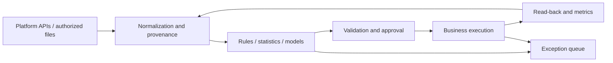

# AI Ecommerce Automation Guide

[Home](../../README.en.md) · [简体中文](../zh-CN/handbook.md) · [Tool catalog](../tools.md) · [Evidence and sources](../sources.md)

This guide follows everyday ecommerce work: researching products, preparing content, acquiring customers, and handling orders and service. Read it in order or go straight to the task you need. The [tool catalog](../tools.md) contains names and official links; the chapters focus on approaches, tradeoffs, and things that can go wrong.

Some approaches have only been checked against documentation; others have had limited testing. The relevant sections state what was checked and what remains to be tried.

## Contents

1. [Choose a first task](#c01)
2. [Connect data, models, and business systems](#c02)
3. [Agree on fields and metric definitions](#c03)
4. [Market research and product selection](#c04)
5. [Review analysis and demand discovery](#c05)
6. [Supply chain and product truth](#c06)
7. [Listings and localization](#c07)
8. [Product images and visual consistency](#c08)
9. [Short video and content production](#c09)
10. [Creator research and partnerships](#c10)
11. [Advertising diagnosis and experiments](#c11)
12. [Support, after-sales, and retrieval](#c12)
13. [Orders, inventory, and fulfillment](#c13)
14. [Store growth and repeat purchases](#c14)
15. [Platform integrations and Chuhaijiang](#c15)
16. [Agents, MCP, and browser automation](#c16)
17. [Reliability, security, and evaluation](#c17)
18. [Costs, teams, and implementation](#c18)
19. [What still needs testing](#c19)
20. [24 workflow ideas](#c20)

<a id="c01"></a>
## 01 · Choose a first task

Look at what the team repeats every week when choosing a first task. Sorting reviews, extracting inquiry requirements, and finding exceptional orders are relatively easy to define: what goes in, what should come out, and who handles an error. A request to “run my store” contains too many open decisions for a first project.

If people must supply missing documents or change definitions every time, address that first. Otherwise, they will still be explaining the task to the model, and time saved on data entry will go into corrections.

Describe the task in a few lines: where the data comes from, when work starts, who needs the result, the deadline, and who handles failures. Record current processing time and common omissions. Include review and editing when comparing the new process with the old one; model generation speed alone overstates the savings.

If there are several candidates, consider frequency, time per task, and how consistent the steps are. Then check the cost of mistakes, interface access, and maintenance ownership. These factors do not need to become one numerical score. A daily report and an automatic refund can take similar time but need very different release conditions. Start refunds, bulk price changes, and purchasing with recommendations or tasks for review.

You can introduce automation gradually within one task. Start with organizing information and drafting. Once drafts are dependable, let a person approve execution. Well-defined rules may later run within limits on amount and scope. Allowing the system to change strategy needs a separate assessment.

Full autonomy need not be the target. A process that reliably produces usable drafts and passes exceptions to the right person can be worth keeping.

For an initial trial, choose ten de-identified historical inputs and describe the desired result and unacceptable errors for each. Run different approaches on the same material and record what needed editing and how long it took. Ten cases help reject clearly unsuitable approaches. Before deployment, add more cases, especially missing information, duplicates, and invalid data.

<a id="c02"></a>
## 02 · Connect data, models, and business systems

A workflow passes through several stages between reading store data and changing a product or producing a report. Separating them makes troubleshooting easier. Here they are grouped into six layers: sources read platform and warehouse data; the data layer organizes fields; reasoning runs rules or models; orchestration manages steps and retries; execution calls business interfaces; observation checks results and costs.

If a report is missing orders, check the source and transformations. If the figures are correct but the explanation is wrong, inspect the model step. If approved content was not sent, inspect execution and its returned state. These divisions also make tools easier to replace.



n8n can connect APIs and business steps. Consider Dify for knowledge applications, LangGraph when writing a stateful agent, and Temporal for long-running processes. They overlap; begin with the one that fits the immediate work. Product descriptions and references are in the [source directory](../sources.md).

A small team can begin with a spreadsheet, one orchestrator, and one model interface. Store product information separately from task status; keep media in a file library and put references in the table. Add a database, queue, or dedicated service when concurrent editing, volume, or audit requirements justify it. This makes it easier to distinguish a process problem from a need for more infrastructure.

Use code for arithmetic and stock thresholds. Try models for review classification, inquiry extraction, and rewriting. Check their results with code for amounts, required fields, and allowed values. The same model should not both propose an action and have sole authority to approve it.

Check the result after execution. A product update may still be processing despite a successful API response. A generated video may contain incorrect text or distorted objects. An accepted email may not have been delivered. Define completion for each action and store “submitted” separately from “confirmed” so failures are easier to investigate.

<a id="c03"></a>
## 03 · Agree on fields and metric definitions

Before joining two sales datasets, check what each counts. One may contain units ordered, another units paid, and a third-party source may contain estimates. Putting them in one column produces misleading comparisons. Record units, currency, period, time zone, refund handling, and freshness during setup. Leave unknown values empty and explain why.

Useful fields include `source`, `source_record_id`, `observed_at`, `market`, `metric_window`, and `schema_version`. Store currency alongside money, use time-zone-aware timestamps, and map platform product IDs to internal SKUs. Missing data, a real zero, and a failed request are separate states.

```json
{
  "schema_version": "1.0",
  "source": "synthetic",
  "source_record_id": "demo-product-001",
  "observed_at": "2026-09-23T00:00:00Z",
  "market": "US",
  "sku": "DEMO-001",
  "metric_window": "last_7_days",
  "price": {"value": "29.90", "currency": "USD"},
  "sold_units": null,
  "data_status": "missing"
}
```

The example above is synthetic. In an integration, record transformation versions so an aggregate can be traced back to its inputs. Third-party research and store orders can share a report, but their sources should remain clear. When figures disagree, compare periods and definitions, then look for missing or duplicate records. Do not ask the model to choose by plausibility.

Separate raw inputs, standardized tables, and drafts or execution results. Decide who can read raw data and how long to keep it. Public examples should use synthetic or explicitly publishable material. Check log fields as well, so debugging code does not copy order or conversation details into logs.

Knowledge files need an applicable scope too. Identify the SKU for a manual, the market for a return policy, and the date it takes effect. Filter by permission and version before matching content. A fluent answer based on an old policy can still make an incorrect promise.

<a id="c04"></a>
## 04 · Market research and product selection

Before asking AI to select products, list your conditions: destination market, precise category, sourcing and packaging costs, size and weight, minimum order quantity, lead time, support capacity, and test budget. These conditions change the shortlist. Asking only for “winning products” gives little basis for judging whether a recommendation fits your suppliers or finances.

Put authorized product data or platform reports in a table. Use rules to remove products outside cost or dimension limits, then ask a model to organize needs and content angles for the remaining candidates. Procurement checks quotes and samples; operations checks whether the selling point can be demonstrated. Choose a small number to test. Chuhaijiang is one possible input; see its [tested scope](../integrations.md).

Keep a page for each candidate with demand evidence, prices, competitors, shipping requirements, content ideas, and missing information. Write observations separately from interpretations. More associated videos can be recorded as an observation; sustained demand growth still needs to be distinguished from seasonal promotion or concentrated activity by a few accounts. Keep evidence against a recommendation as well as evidence for it.

For an initial economic model, list net revenue, sourcing, inbound freight, last-mile delivery, storage, platform and payment fees, creator commissions, advertising, and expected returns losses. Use one currency and an explicit tax treatment. Price minus sourcing cost is not net profit. Compare low, central, and high scenarios, focusing on assumptions that turn contribution negative rather than presenting only the optimistic case.

The [unit-economics example](../../examples/unit_economics.py) demonstrates per-order contribution only. It does not perform tax filing, currency conversion, or financial settlement. Every price and cost is synthetic. The example supplies a calculation framework, not a substitute for quotes and bills.

Before spending on a test, decide what would make you reject the product: a failed sample, shipping above budget, or unavailable rights to required assets. For candidates still under consideration, identify what the next expense is meant to establish. If the result is only “it seems promising,” the decision to buy stock will remain difficult.

<a id="c05"></a>
## 05 · Review analysis and demand discovery

Positive and negative labels are often too broad for product reviews. “Too small” might mean the buyer chose the wrong variant, misunderstood measurements, or needs a larger model. Keep the variant, date, rating, and source record attached before classifying. That helps distinguish a product problem from a page problem.

Extract the situation, component, issue, and supporting passage from each review, then group similar issues. One review may discuss packaging and installation, so theme counts can exceed the review count. State sample size and counting rules so readers do not mistake the percentages for mutually exclusive categories.

For translated reviews, retain a controlled reference to the original or a record ID for human inspection. Public reports should contain necessary short excerpts and aggregated observations, without names, avatars, order numbers, or contact details. A strongly worded individual review is not automatically a widespread need. Duplicate reviews are not independent evidence.

A useful output includes `theme`, `evidence_ids`, `affected_variant`, `severity`, `uncertainty`, and `suggested_validation`. Business rules should define severity. Safety failures, injuries, and factual disputes should go to a dedicated queue, not be automatically closed by a sentiment classifier.

Send specific findings to the people who can check them. For size confusion, inspect the dimension chart; for installation trouble, inspect the manual and video; for damage, investigate packaging and shipping. Reviews identify experiences but may not establish causes. Check the cause before spending time rewriting a page when the actual problem is in the product.

This can start with an authorized export, Python cleaning, classification through Dify or a model API, and spreadsheet review. Chuhaijiang also documents a review-analysis endpoint, but this repository has not tested its quality. Compare incorrect labels, support from the original passages, and editing effort. Report length is not a useful measure.

<a id="c06"></a>
## 06 · Supply chain and product truth

A purchasing sheet can list one size while the listing shows another and support uses an old manual. Scattered product information makes these inconsistencies easy to create. Start with one confirmed reference table for copy, photography, and support. This guide calls that the product fact repository.

Include SKU, model, color, dimensions, material, accessories, compatibility, limitations, photographs, manuals, and permitted claims. Separate confirmed facts, marketing language, and hypotheses. Supplier claims about certification or performance need supporting documents applicable to that model. Until verified, they remain pending claims.

Supplier comparisons should standardize quote currency, validity, trade terms, packaging, lead-time definitions, and sample charges rather than compare unit price alone. A model can extract candidate fields from authorized documents; procurement should verify numbers and conditions. OCR errors, shifted columns, and mixed units can cost much more than the time saved.

Keep a version and date when product information changes. If a material changes, list affected listings, support answers, scripts, and images, then update them. Preserve old versions: previously sold products may still need the old instructions. Being able to find the relevant document by SKU and version makes after-sales work easier.

Manufacturers can start with inquiry extraction. From an authorized inquiry, extract market, use, quantity, specifications, customization, timing, and unanswered questions, then draft an English reply. Sales staff complete or confirm price, certification, and delivery. Judge the result by fewer omissions and clarification rounds, not by treating draft volume as sales performance.

Pick a few specifications and try to find their original manuals or confirmation records. Then change one specification and check whether the affected pages and assets can be located. Unconfirmed fields should remain pending rather than becoming definite claims when copy is generated.

<a id="c07"></a>
## 07 · Listings and localization

For an English listing, establish the destination market first. Units, common terms, accessory names, and descriptions of the same feature may differ. Preserve functions, certificates, warranties, and delivery terms from the source material. Clarify ambiguous Chinese specifications before translating rather than filling gaps while writing.

Take confirmed selling points from the product table, draft titles, bullets, descriptions, and search terms, then check length, parameters, and restricted language. Keep these checks separate and give operations a preview. Configure fields and limits by platform, market, and category instead of applying one unchanged template everywhere.

Keep a source reference for each claim, such as `claim_id → source_id`. Absolute statements such as “permanent” or “100% effective” need supporting material; otherwise remove or revise them. If a document only says “compatible with various devices,” the model should flag compatibility for clarification rather than inventing model numbers.

Publish through a diff showing the previous value, proposed value, evidence, affected SKU, and scope. Execute after approval and read back the actual fields and status. Record partial failures per variant. Before restoring a prior version, check that unrelated inventory or pricing changes will not be overwritten.

Have a reader familiar with the market check language, product staff check specifications, and operations check format. Observe clicks and conversion separately after publication. If clicks and returns both rise, investigate whether the copy created the wrong expectation rather than judging the change by clicks alone.

A product table, model API, field checks, and a draft queue are enough to begin. Shopify, Amazon, and Etsy need separate adapters for fields, interfaces, and authorization. Official starting points are in the [source directory](../sources.md); this repository has not completed every adapter.

<a id="c08"></a>
## 08 · Product images and visual consistency

Check whether generation changed the product before judging the image. An extra button, relocated port, or altered package text can make an attractive image unusable. Prepare photographs from several angles and cutouts, mark areas that must stay unchanged, then work on backgrounds, lighting, and composition.

Review listing images, usage scenes, and concepts differently. Compare listing images with the actual product. Check whether a depicted use is possible. Label concepts so they do not end up in a publishing queue by mistake. Separate folders or asset-table categories are easier to manage than remembering the intended use of each file.

ComfyUI organizes node-based visual workflows; capabilities depend on models and nodes. Verified cloud image services can join the same asset pipeline. Compare reference control, editing, batching, speed, licensing, and human rework. Evaluate repeated outputs across the same product set, not one best image. [ComfyUI documentation](https://docs.comfy.org/)

Fix the product reference, create background and layout options, composite the product, and check outline, color, and structure. Add parameters and longer copy in a layout tool. Inspect clipping, obstruction, and spelling after export. This also lets a specification change stay within a text layer instead of requiring another generated image.

Asset metadata should include origin, rights scope, SKU, model or editor version, configuration, approval, and expiry. Seeds can assist reproducibility but cannot guarantee identical output across versions. Use people and voices only with appropriate rights. Public availability does not establish commercial permission.

Keep the original photograph beside the output and compare appearance, text, and demonstrated functions. Check platform dimensions and rights. Include rejected outputs and manual editing when calculating cost per usable image. If only one of ten outputs is usable, the price of a single generation is not the cost of the finished image.

<a id="c09"></a>
## 09 · Short video and content production

Decide what the video needs to explain before generating it. For installation, list the actions a buyer must see clearly. For a selling point, decide what footage supports the claim. A complex or expensive product may need a listing, review, or live demonstration after the short video to answer remaining questions.

Find topics in reviews and support questions, then check them against product information. Record duration, visuals, action, narration, subtitles, and sources in the storyboard. For narration-led pieces, establish speech before arranging shots. For installation or operation, establish clear demonstrations before adding narration. These do not need the same production order.

After approving the script, create keyframes and short clips, select usable shots, and edit, subtitle, and mix. Short sections let you replace a failed shot without regenerating everything. Prefer real footage for intricate mechanisms, installation, and performance demonstrations where viewers need accurate details.

FFmpeg can handle repetitive assembly and transcoding; ComfyUI or cloud services can supply some visuals. Check codec, model, and asset terms separately. Compare the finished video with product facts: a successful render establishes only that a file was created. [FFmpeg documentation](https://ffmpeg.org/documentation.html)

Generation is often asynchronous. Record the task ID, submission time, polling interval, deadline, and final state. Check an existing task after a timeout before submitting again and incurring another charge. Store completed assets in a controlled library and inspect both technical and content quality. Expiring download links are not a permanent asset repository.

Reuse raw material while adapting aspect ratio, subtitle placement, cover, title, and language for each platform. Confirm account, time zone, file version, and product association before posting, then save the post ID. Review views, retention, clicks, orders, and returns separately. Many views with few product clicks require a different investigation from orders followed by frequent returns.

Watch the finished video and listen to the audio, checking product structure, actions, subtitles, and speech. Save the script, assets, and changes for each published version. Later, when results differ, you can identify which opening, narration, or demonstration changed instead of trying to remember.

<a id="c10"></a>
## 10 · Creator research and partnerships

Start by checking what a creator publishes, where the audience is, and whether their format suits the product. A large but unrelated audience may not justify priority. A product that needs installation explained may not suit an account focused on static presentation. Include the cost of samples and follow-up work in the decision.

Build a candidate list from authorized data, then ask a model to summarize style, product fit, and unresolved questions with links. Scores can help decide whom to review first, but estimated sales should not become promises. Coverage varies between sources; explain the basis for matching accounts or attributing results across platforms.

Track pending review, pending contact, contacted, negotiation, samples, production, published, and settlement in a table. Assign each record a person or role. AI can prepare briefs, compare terms, draft messages, and flag unfinished work. Sending, agreeing contracts, and paying sample costs need their own authorization steps.

Tell the creator the product facts, demonstrations needed, claims to avoid, deliverable files, and usage rights. Mark unresolved fees, commissions, and deadlines as pending. Before sending a draft, check especially for fluent sentences that quietly add a commitment nobody agreed to.

Public examples should use aggregate measures and fictional identifiers, not contact details, conversations, or private commercial terms. Public account visibility does not justify unnecessary personal profiling. Keep only essential contact data in the operating system and restrict exports. Research access and permission to contact are separate matters.

Review how many candidates were suitable, how many replied, how many delivered after receiving samples, and what the content and orders showed. State each denominator. Replies followed by poor content may point to selection or briefing problems. A low quote that requires many rounds of coordination should include that management time in its cost.

<a id="c11"></a>
## 11 · Advertising diagnosis and experiments

Start advertising automation with reporting and anomaly checks. Read authorized spend, impressions, clicks, conversions, and attribution windows, grouped by market, ad group, and creative version. Check completeness first. Stopping an ad before delayed conversions have appeared may mistake reporting lag for a performance decline.

Calculate CTR, CPC, CVR, and ROAS in code. A model can discuss changes and propose checks. Mark zero-denominator metrics as unavailable. List platform-attributed revenue separately from net store revenue. One order may be attributed to several channels, so their ROAS figures should not be added together.

Authorize report reading separately from budget changes. Get detection working first. Budget changes need amount limits, intervals between changes, observation periods, and result checks. Investigate tracking failures, unusual orders, or stockouts before adjusting spend. When samples are too small, continued observation is a valid outcome; a daily report need not always recommend increasing or stopping spend.

Define the primary metric, minimum meaningful difference, budget, and stopping rule before an experiment. Changing audience, script, landing page, and price simultaneously obscures causality. Hold key conditions stable and test a few specific hypotheses. Sample size and duration depend on variability and scale, not a universal number of days.

Google Ads API is an official integration starting point; account permissions and developer configuration follow current documentation. Check other platforms and Chuhaijiang advertising endpoints individually. Reporting access does not establish full campaign execution access. [Google Ads API](https://developers.google.com/google-ads/api/docs/get-started/introduction)

For each recommendation, record the change observed, metric definitions, possible causes, proposed test, maximum spend, and review date. Attach the result after the test. Over time, this makes it possible to check which recommendations helped and which explanations only sounded plausible afterward.

<a id="c12"></a>
## 12 · Support, after-sales, and retrieval

Support reply drafts are a manageable starting point. Determine whether a question needs product instructions, policy, or order information, then retrieve the applicable material and leave references with the answer. Before returning order details, verify that the requester is entitled to see them. An order number alone should not disclose a shipping address.

Organize scope before setting up retrieval. Identify the model covered by a manual, the country covered by delivery and return rules, and their effective dates. Otherwise a model may quote a passage accurately but apply the wrong policy. Escalate missing information, update the knowledge base, and then re-run the question.

Start with well-supported questions about dimensions, accessories, and installation, then consider order explanations. Refunds, compensation, chargebacks, injuries, and disputes require dedicated processes. Separate knowledge answers, policy decisions, and financial actions so that one misunderstanding cannot directly cause an irreversible operation.

Evaluation cases should include ordinary questions, ambiguity, policy conflicts, stale documents, hostile instructions, and unauthorized requests. A message demanding that the system ignore rules and export customer records is input, not an administrator command. Test each supported language rather than inferring global readiness from one-language performance.

Gorgias is a candidate support workspace, Dify can organize knowledge applications, and Qdrant can provide vector retrieval. Selection depends on existing systems and team skills. Managed support products and self-built retrieval have different maintenance responsibilities. Compare them on the same question set, including escalation and data handling. [Gorgias](https://developers.gorgias.com/) · [Qdrant](https://qdrant.tech/documentation/)

When reviewing replies, open the cited source and look for added promises, incorrect policies, or unrelated order details. Check whether escalation was timely and whether customers had to contact support again about the same issue. Faster replies with more repeated explanations still need improvement.

<a id="c13"></a>
## 13 · Orders, inventory, and fulfillment

Keep inventory deductions, payment state, and shipment confirmation in transaction and warehouse systems. Models can read exceptions and suggest actions, but their generated numbers should not directly change stock. If a model suggests cancelling an order, verify current state and apply the established rules first.

Verify a platform event, store it in a durable queue, and have a handler read current order state before taking the appropriate action and recording its result. Events can arrive repeatedly, so processing must be idempotent. Shopify documents duplicate delivery and signature verification in its [integration guidance](https://shopify.dev/docs/apps/build/webhooks/verify-deliveries).

Deduplication and execution create a consistency problem. Recording success first can lose work; executing first can repeat it after a crash. Production designs need transactions, unique constraints, operation idempotency, or an outbox pattern, plus reconciliation. An in-memory set of processed IDs disappears on restart.

Start stock alerts with available, allocated, and inbound inventory, average demand, and replenishment lead time. Demand variability, seasonality, promotions, and supplier delays can invalidate simple forecasts. Calibrate safety stock with real data rather than treating illustrative coefficients as universal settings.

A shipping exception workflow can read authorized carrier or ERP status, create tasks for delays, and draft support messages for review. Stale status, incomplete addresses, and lost packages require different responses. Do not invent delivery dates or create another label merely because an interface temporarily returns no data.

Before deployment, send the same event repeatedly and deliver events out of order. Check for extra stock deductions and whether shipped orders regress to an earlier state. Also try timeouts, partial success, expired credentials, and queue buildup. Stale tasks must not overwrite human changes, and reconciliation should find missed records.

<a id="c14"></a>
## 14 · Store growth and repeat purchases

Before connecting store messaging, recommendations, and analytics, inspect events. When are views, cart additions, checkout starts, and purchases reported? Could two plugins report the same action? Record timing, sources, and deduplication. Duplicate reporting can trigger the wrong marketing actions as well as distort conversion figures.

First make records from visits through purchase and service inspectable. A store with few orders can begin with rules based on category, compatibility, stock, and purchase history rather than training a complex model. Before showing recommendations, check availability, market eligibility, and compatibility with products the customer already owns.

Email and SMS need subscription, opt-out, frequency, and suppression rules. Klaviyo's API documentation is an integration starting point; verify account capabilities and applicable requirements. Begin with drafts and pre-send checks, then connect authorized sending. A purchase does not imply unrestricted contact across every channel. [Klaviyo API](https://developers.klaviyo.com/en/reference/api_overview)

SEO content should answer real product questions. Generating many near-identical pages adds maintenance and factual conflicts. Dimension comparisons, installation guides, and use-case pages should be accurate, clear, and maintainable. Each page needs informational value beyond swapped keywords.

Start analytics with order and advertising tables. Consider Airbyte for synchronization, dbt for transformations and metrics, and Metabase for queries and dashboards. Verify individual connectors, fields, and authorization rather than assuming every platform is supported. Check a few orders and aggregates manually before asking a model to explain business performance.

Record revenue after returns, contribution, opt-outs, and complaints when evaluating retention work. Product changes and better delivery may also improve repeat purchases. Keep a reasonable comparison with the original process where possible. Without a control, at least list other changes made during the period rather than assigning all growth to automation.

<a id="c15"></a>
## 15 · Platform integrations and Chuhaijiang

Check access conditions separately for each platform. Shopify, Amazon SP-API, TikTok Shop, and Etsy differ in registration, merchant authorization, data scope, and quotas. Access to public product information does not authorize store operations, and third-party market figures do not replace store settlement records.

Read current documentation, confirm region and account permissions, then make a small read-only request. Record field mappings and error types. Test pagination, timing, and missing values before adding writes. Check authorization configuration when authentication or permission errors occur rather than retrying blindly.

On 2026-09-23, this edition retrieved Chuhaijiang's official OpenAPI schema and made one scoped `GET /open/v1/products/search` request using `country=us`, `keyword=desk organizer`, `page=1`, and `page_size=3`. Three records were returned. This proves that request succeeded, not complete market coverage, data accuracy, or availability of other endpoints.

The official schema also lists reviews, associated creators, video breakdown, review analysis, publishing, and asynchronous task queries. These are labeled as documented; untested endpoints remain untested. No publishing, advertising execution, or social messaging was performed.

Use an allowlist of research fields such as product identifiers, market, price range, and relevant metrics. Shop identities, avatars, contacts, raw request identifiers, and account balances do not belong in public examples. Inject keys through credential management, never workflow JSON, screenshots, URLs, or commits.

When prose and enums disagree, document the ambiguity and verify minimally. A sort field description can differ from the schema's enumeration. Check current documentation and actual behavior rather than inventing a correction. The tested query omitted sorting and establishes no compatibility claim for that parameter. See the [integration recipe](../integrations.md) for errors and scope.

<a id="c16"></a>
## 16 · Agents, MCP, and browser automation

Consider an agent when the next step depends on what it finds, such as continuing research on a product and organizing open questions. Ordinary workflows are easier to inspect for fixed steps such as cleaning orders, calculating costs, and exporting reports. They can work together: an agent proposes a plan, and code checks arguments and permissions before execution.

MCP can connect tools, but successful connection does not establish appropriate authorization. Separate reading, drafting, publishing, and financial operations, with account and resource limits. Validate arguments, access, and audit records on the tool server. A prompt saying “be careful” is not an access-control system.

OpenClaw's documented role includes a self-hosted gateway connecting messaging channels and AI agents. It is not a specialized ecommerce crawler. It can provide an interaction layer for research assistance, while actual commerce functions require integrations and permissions. A messaging entry point is not a complete operating backend. [OpenClaw documentation](https://docs.openclaw.ai/)

Playwright and Browser Use are candidates for bounded, authorized browser tasks where a suitable API is unavailable. Layout changes, expired sessions, additional verification, and ambiguous controls add maintenance. Stop for login challenges, captchas, or access denial and route them to authorized handling rather than making evasion the objective.

Web pages, reviews, and emails are untrusted input. They may claim approval for a payment or request access to local secrets. Treat such text as material to analyze. User authorization and system rules govern tool calls; an external page cannot expand permissions. Process external files with isolation and limited access.

Give the first research agent read-only access and have a person review its structured drafts. Add reversible actions such as saving drafts after proving useful. Stop when the budget is spent, permission is unclear, evidence is missing, or task state is uncertain. Leave enough information for a person to continue the work.

<a id="c17"></a>
## 17 · Reliability, security, and evaluation

When a workflow fails, you should be able to find its run ID, timing, input version, current state, error, and cost. Distinguish missing fields, invalid model output, temporary interface failures, and rejected business actions. They need different fixes; retrying is not a solution to all of them.

Retry according to operation type. Read-only calls may use bounded backoff for transient failures. Authentication, balance, and permission failures should stop. Before repeating a write, establish whether it already succeeded. Follow service guidance with total time and cost caps. Preserve unresolved jobs in a dead-letter queue that people can inspect.

Validate model output as structured data, then check facts, money, enums, and links. A repaired parse does not create authorization. Bind approval to a specific content version and require renewed approval after changes. At execution, check whether the relevant order, stock, or price has changed.

Apply least privilege: research accounts do not publish; publishing accounts do not refund; logs do not retain full customer records. Isolate tenants and credentials across stores. Backups need access controls and retention, and deletion processes should address replicas, caches, and exports as well as primary records.

Testing has three levels: static checks for files, links, and configuration; offline tests using synthetic data; integration tests against real platform behavior. Passing the first does not establish the third. This repository states its demonstration and validation scope. The n8n template has not been imported into a live instance or tested for external publishing.

Keep fixed inputs, expected results, and the model configuration for each test. After an upgrade, compare accuracy, unsupported claims, escalation, cost, delay, and editing on the same inputs. Add new failures as they occur. Check money, product claims, and personal information separately rather than hiding serious errors in an average score.

<a id="c18"></a>
## 18 · Costs, teams, and implementation

Include model calls, servers, development, maintenance, review, and error handling when comparing costs. A cheaper model that needs frequent retries may cost more overall. Compare what it takes to produce one usable result, and report review time separately so it is clear whether the workload fell.

Proceed as results allow: organize the task and product information and record current effort; try synthetic or de-identified inputs; connect real read-only data and compare with manual work; then open execution for lower-consequence actions. Do not expand to more products or stores while important facts are still wrong.

Agree who sets business rules, maintains the system, and handles errors. Small teams may combine roles, but write the responsibilities down. Also record who can change prompts, approve content, adjust budgets, and resume paused tasks. A replacement operator should be able to find the configuration and recovery steps without relying on someone else remembering them.

A review report is a useful pilot. Operations supplies authorized samples, code cleans them, a model classifies them, and a person checks labels before aggregating a few concrete issues. The product team chooses an improvement and watches related reviews and returns in the next period. This checks whether classification is accurate and whether anyone uses the report.

If several revisions still leave more review work than the original process, narrow the scope or return that part to rules and people. Some tasks are not worth connecting to a model. Record what worked and what did not so the next tool or process change does not start from guesswork.

Review APIs, licenses, dependencies, fields, and platform policies periodically. Try new models or images in a test environment and check outputs, permissions, and costs before changing production. Keep product information, test cases, and field definitions separately so they remain usable when tools change.

<a id="c19"></a>
## 19 · What still needs testing

The following directions need more testing before this repository could recommend them for dependable operation. The table gives a reason to investigate, a first test, and the conclusion that remains unsupported. Start with the limited test if you plan to develop one of them.

| Direction | Rationale | Smallest useful validation | Claim not yet justified |
|---|---|---|---|
| Product selection through profitability | Research, content, and orders can exchange data | One category, capped budget, complete cost tracking | Automatic winners or persistent profit |
| Cross-platform demand prediction | Sources may offer complementary signals | Time-based holdout against a simple seasonal baseline | Third-party popularity equals future sales |
| Unattended dynamic pricing | Rules can respond to stock and competition | Shadow mode, then bounded SKUs and prices | Universal contribution improvement |
| End-to-end creator partnerships | Information and status work can be automated | Candidate accuracy and brief-quality tests first | Deals without negotiation |
| Autonomous after-sales decisions | Some rules and facts are computable | Replay historical cases and inspect costly errors | AI can resolve every dispute |
| Unified consumer identity | Touchpoints could be studied together | Limited analysis of appropriately authorized data | Unrestricted cross-platform tracking |
| New or closed platforms | Workflow concepts may transfer | Verify official access and account permissions | Unverified APIs already exist |
| Agent procurement and payment | Repeated entry could be reduced | Recommendations and approval without live payment | Any agent can spend safely |

Measure possible downsides too. Compare forecasts with simpler methods, inspect missed support escalations, track order losses and complaints after price changes, and watch misunderstandings and returns after content changes. Put these results beside benefits and costs to judge whether the change is worthwhile.

Keep manual steps while facts, permissions, stable interfaces, or an exception owner are missing. Reconsider automation when those conditions improve. For actions that are difficult to reverse, an available API alone is not enough reason to deploy without a recovery method.

<a id="c20"></a>
## 20 · 24 workflow ideas

The table lists inputs, steps, candidate tools, and checks for everyday tasks. These combinations are reference designs, not deployed products. Choose one product or task type for a trial. See the [example notes](../../examples/README.md) for available offline demonstrations.

| Scenario | Input → processing → output | Candidate stack | Acceptance or stopping rule |
|---|---|---|---|
| Industry brief | Authorized RSS → deduplication and summary → review draft | n8n + model | Original links required |
| Product screening | Product data and costs → hard filters → candidates | Chuhaijiang + Python + table | No purchase conclusion without costs |
| Price observation | Same-variant snapshots → comparability check → alert | Authorized API + database | Reject mixed currency or variants |
| Review themes | Reviews → multi-label classification → issues | Dify + table | Evidence IDs for each theme |
| Product facts | Manuals and quotes → extraction → review table | Parser + model | Human verification of specifications |
| Localized listings | Facts → rewriting and checks → draft | Model + platform API | Block unsupported claims |
| Image variants | Photographs and layout → compositing → assets | ComfyUI + layout | Preserve product structure |
| Video variants | Script and shots → generation and editing → draft | Cloud generation + FFmpeg | No fictional functionality |
| Creator matching | Product and content → fit analysis → review list | Authorized data + model | Scores do not guarantee deals |
| Partnership brief | Facts and agreed terms → organization → draft | Template + model | Never fill unknown fees |
| Ad reporting | Spend and conversions → metrics and explanation → queue | Ads API + SQL + model | Missing data stays explicit |
| Creative experiments | Hypothesis and assets → version comparison → record | Asset library + analytics | Clear budget and stop rule |
| Support drafts | Question and policy → retrieval → grounded reply | Gorgias or Dify | Escalate without evidence |
| Return reasons | Authorized service records → aggregation → suggestions | Python + BI | Review causal explanations |
| Order exceptions | Event → state verification → task | Webhook + queue | No duplicate processing |
| Stock alerts | Available and inbound stock → rules → recommendation | ERP export + Python | No automatic purchasing |
| Shipping explanations | Carrier state → interpretation → draft | Authorized API + model | No invented arrival promises |
| Repeat-purchase content | Permitted events and products → planning → draft | Klaviyo + templates | Honor opt-outs and frequency |
| Operating report | Standard accounts → metrics → traceable explanation | dbt + Metabase + model | Separate GMV and contribution |
| Manufacturer inquiry | Authorized inquiry → extraction → reply draft | Table + model | Confirm price and lead time |
| Asset quality | Asset and facts → automated and human checks → issues | Vision model + validator | No automatic pass on uncertainty |
| Stale knowledge | Versions and dates → rules → update task | Database + orchestrator | Re-test affected answers |
| License review | Tool list → official terms → adoption record | Human review + version table | Downloadable does not mean commercial use |
| Cost anomalies | Usage bills → budget checks → pause recommendation | Gateway + metrics | Incomplete bills are not final accounts |

### Developing three of these ideas

Start review analysis with one product and check whether labels match the source passages. Then group by variant and period, and send findings to whoever maintains listings or manuals. After changes, track the same themes and return reasons. Keep change dates so the periods can be compared.

Organize sources and duplicates before adding summaries to an industry brief; consider scheduled delivery afterward. Preserve source links, publication dates, and scope. Identify articles that repeat one original report so repeated coverage is not mistaken for several independent sources.

Start stock alerts with availability and a threshold, then add inbound units, lead time, seasonality, and promotions as needed. Compare each addition with historical or manual results. If base inventory does not reconcile, address synchronization and stock counts before adding forecasting.

### Common terms

| Term | Meaning in this guide |
|---|---|
| Workflow | A process with explicit steps and conditions |
| Agent | A program choosing tools and steps within bounded goals |
| RAG | Retrieving applicable evidence before generating an answer |
| MCP | A protocol approach for connecting tools and context |
| Idempotency | Repeating an operation creates no additional business effect |
| Dry run | Compute or preview without external writes |
| Shadow mode | Observe alongside production without affecting decisions |
| Human review | A responsible person checks a specific result |
| Contribution | Revenue less explicitly defined variable costs |
| Evidence | Material that can be located, checked, and scoped |

If you are unsure where to begin, return to the first chapter and choose one weekly task. Record current effort, try a batch with an approach from this guide, and compare time saved with the checks it introduced. Use those results to decide which tool to connect next.